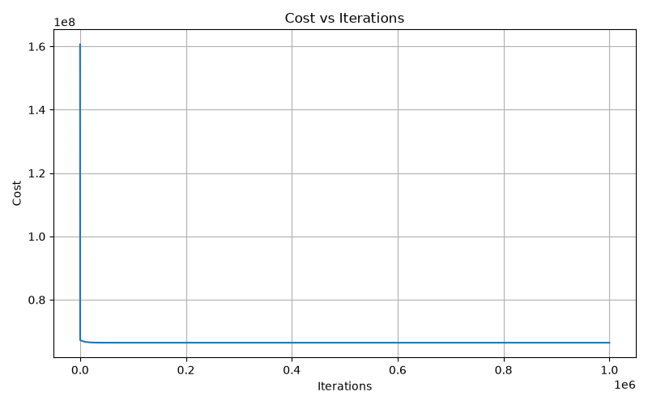
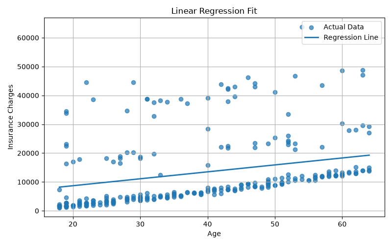

# Linear Regression From Scratch

A complete implementation of **Linear Regression** from scratch using **NumPy**, without using Scikit-learn for training.

This repository is part of my **Machine Learning From Scratch** journey, where every algorithm is first understood mathematically, then implemented manually, and finally verified against Scikit-learn.

---

## Project Overview

This repository contains two complete implementations:

- ✅ Univariate Linear Regression
- ✅ Multivariate Linear Regression

Both models are trained using **Batch Gradient Descent** and independently verified against **Scikit-learn**.

---

# Gradient Descent Convergence

The graph below shows how the cost decreases as Gradient Descent learns the optimal parameters.

<p align="center">
    
</p>

---

# Univariate Linear Regression

The objective is to predict insurance charges using a **single feature**.

### Input Feature

- Age

### Target

- Insurance Charges

The learned model is

\[
\hat{y}=mx+c
\]

The regression line learned by Gradient Descent is shown below.

<p align="center">
    
</p>

---

# Multivariate Linear Regression

The multivariate implementation predicts insurance charges using multiple features.

### Features

- Age
- Sex
- BMI
- Children
- Smoker
- Region

Categorical variables are converted using **One-Hot Encoding** before training.

The learned model is

\[
\hat{y}=XW+b
\]

Unlike univariate regression, the learned model exists in a higher-dimensional feature space and therefore cannot be visualized using a single regression line.

---

# Mathematical Formulation

## Cost Function

Both implementations minimize the Mean Squared Error (MSE):

\[
J(W,b)=\frac{1}{2n}\sum_{i=1}^{n}(\hat y_i-y_i)^2
\]

---

## Gradient Descent

Parameters are updated iteratively according to

\[
W:=W-\alpha\frac{\partial J}{\partial W}
\]

\[
b:=b-\alpha\frac{\partial J}{\partial b}
\]

where

- \(W\) is the weight vector
- \(b\) is the bias
- \(\alpha\) is the learning rate

---

# Repository Structure

```text
linear-regression-from-scratch/

├── data/
│   └── insurance.csv
│
├── images/
│   ├── cost_curve.png
│   └── regression_line.png
│
├── univariate/
│   ├── train.py
│   ├── compare.py
│   ├── weights.npy
│   └── bias.npy
│
├── multivariate/
│   ├── train.py
│   ├── compare.py
│   ├── weights.npy
│   ├── bias.npy
│   └── cost_history.npy
│
├── LICENSE
├── README.md
├── requirements.txt
└── .gitignore
```

---

# Features

- Linear Regression implemented completely from scratch
- Univariate Linear Regression
- Multivariate Linear Regression
- Batch Gradient Descent
- Mean Squared Error Cost Function
- NumPy Vectorization
- One-Hot Encoding
- Model Saving & Continued Training
- Cost History Persistence
- Automatic Cost Curve Generation
- Regression Line Visualization
- Comparison against Scikit-learn

---

# Verification

Both implementations are verified against **Scikit-learn's LinearRegression**.

The comparison includes:

- Learned Weights
- Learned Bias
- Training Cost
- Testing Cost
- Prediction Comparison
- Difference from Scikit-learn

The learned parameters closely match Scikit-learn, validating the correctness of the implementation.

---

# Technologies Used

- Python
- NumPy
- Pandas
- Matplotlib
- Scikit-learn *(verification only)*

---

# What I Learned

Through this project I gained a practical understanding of:

- Linear Regression
- Mean Squared Error
- Gradient Descent
- Learning Rate
- Vectorization
- Feature Engineering
- One-Hot Encoding
- Saving & Reloading Models
- Model Evaluation
- Comparing custom implementations with Scikit-learn

---

# Future Work

This repository is part of my Machine Learning From Scratch roadmap.

Completed:

- ✅ Linear Regression (Univariate)
- ✅ Linear Regression (Multivariate)

Upcoming repositories:

- ⬜ Logistic Regression From Scratch
- ⬜ Neural Network From Scratch
- ⬜ Backpropagation From Scratch
- ⬜ CNN From Scratch
- ⬜ Transformer From Scratch

---

# License

Released under the MIT License.